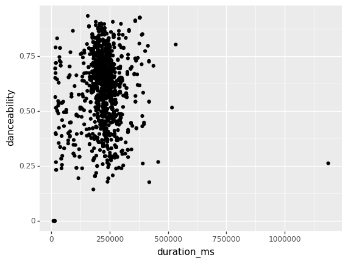
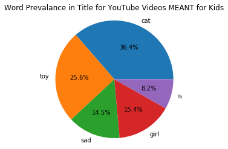

# HW4


## Part I

Use the **PopDivas_data.csv** on GitHub to build a prediction model.

1. Explore the Data
    - What patterns/relationships do you notice?
2. Choose/Build Your Model (*Decision Tree* OR *KNN*)
    - Why did you choose this type of model?
    - Which variables are you including in your model?
    - Choose a model validation technique and explain why you chose it.
    - Which variables did you standardize and Why?    
3. Evaluate Your Model
    - State how it did (and what evidence/metric do you have to support that?)

    
## Part II

Use the **YouTubeKidsVideo.csv** on GitHub to build a Naive Bayes Classifier. This dataset looks at the titles/descriptions of YouTube videos that are (1) and are not (0) meant for kids. The variable KidsVideo is 1 if the video is meant for kids, and 0 if it is not. The other variables are 1 if that word (e.g. "toy", "girl"...etc) is in the title/description of the video, and 0 if it is not.

1. Explore the Data
    - What patterns/relationships do you notice?
2. Build your model
    - Which variables are you including in your model?
    - Choose a model validation technique and explain why you chose it.
3. Evaluate Your Model
    - How did it do? What evidence/metric do you have to support that?

# Part I


```python
import warnings
warnings.filterwarnings('ignore')

import pandas as pd
import numpy as np
from plotnine import *
import seaborn as sns
import matplotlib.pyplot as plt
from sklearn.neighbors import KNeighborsClassifier, KNeighborsRegressor
from sklearn.model_selection import train_test_split
from sklearn.naive_bayes import GaussianNB

from sklearn import metrics 
from sklearn.preprocessing import StandardScaler, LabelBinarizer
from sklearn.model_selection import KFold # k-fold cv
from sklearn.model_selection import cross_val_score # cross validation metrics
from sklearn.model_selection import cross_val_predict # cross validation metrics
from sklearn.metrics import accuracy_score, confusion_matrix, mean_squared_error
#from sklearn.metrics import plot_confusion_matrix

from sklearn.model_selection import GridSearchCV

%precision %.7g
%matplotlib inline
```


```python
divas = pd.read_csv('data/PopDivas_data.csv')
print(divas.head())
print(divas.info())
print(divas.isnull().sum())
print(divas.describe())
```

       Unnamed: 0 artist_name  danceability   energy  key  loudness  mode  \
    0           1     Beyoncé         0.386  0.28800    1   -18.513     1   
    1           2     Beyoncé         0.484  0.36300    5    -8.094     0   
    2           3     Beyoncé         0.537  0.24700    2   -17.750     1   
    3           4     Beyoncé         0.672  0.69600    4    -6.693     0   
    4           5     Beyoncé         0.000  0.00515    9   -22.612     0   
    
       speechiness  acousticness  instrumentalness  liveness  valence  \
    0       0.0602         0.533           0.01670    0.1410    0.399   
    1       0.0368         0.645           0.00000    0.1250    0.201   
    2       0.0793         0.199           0.00001    0.4230    0.170   
    3       0.1770         0.200           0.02750    0.0736    0.642   
    4       0.0000         0.524           0.95000    0.1140    0.000   
    
       duration_ms                    track_name  
    0        43850    balance (mufasa interlude)  
    1       226479                        BIGGER  
    2        46566  the stars (mufasa interlude)  
    3       162353            FIND YOUR WAY BACK  
    4        13853   uncle scar (scar interlude)  
    <class 'pandas.core.frame.DataFrame'>
    RangeIndex: 1599 entries, 0 to 1598
    Data columns (total 14 columns):
    Unnamed: 0          1599 non-null int64
    artist_name         1599 non-null object
    danceability        1599 non-null float64
    energy              1599 non-null float64
    key                 1599 non-null int64
    loudness            1599 non-null float64
    mode                1599 non-null int64
    speechiness         1599 non-null float64
    acousticness        1599 non-null float64
    instrumentalness    1599 non-null float64
    liveness            1599 non-null float64
    valence             1599 non-null float64
    duration_ms         1599 non-null int64
    track_name          1599 non-null object
    dtypes: float64(8), int64(4), object(2)
    memory usage: 175.0+ KB
    None
    Unnamed: 0          0
    artist_name         0
    danceability        0
    energy              0
    key                 0
    loudness            0
    mode                0
    speechiness         0
    acousticness        0
    instrumentalness    0
    liveness            0
    valence             0
    duration_ms         0
    track_name          0
    dtype: int64
            Unnamed: 0  danceability       energy          key    loudness  \
    count  1599.000000   1599.000000  1599.000000  1599.000000  1599.00000   
    mean    800.000000      0.602417     0.645139     5.329581    -6.59192   
    std     461.735855      0.161994     0.199446     3.506414     3.25770   
    min       1.000000      0.000000     0.005150     0.000000   -27.63100   
    25%     400.500000      0.494000     0.517500     2.000000    -7.33900   
    50%     800.000000      0.628000     0.684000     6.000000    -5.82500   
    75%    1199.500000      0.718000     0.797000     8.000000    -4.76400   
    max    1599.000000      0.932000     0.994000    11.000000    -1.35700   
    
                  mode  speechiness  acousticness  instrumentalness     liveness  \
    count  1599.000000  1599.000000   1599.000000       1599.000000  1599.000000   
    mean      0.602877     0.120019      0.205701          0.015319     0.232994   
    std       0.489455     0.135377      0.261146          0.094224     0.208165   
    min       0.000000     0.000000      0.000025          0.000000     0.016200   
    25%       0.000000     0.040100      0.016200          0.000000     0.097800   
    50%       1.000000     0.061500      0.082500          0.000002     0.149000   
    75%       1.000000     0.151000      0.302500          0.000081     0.310000   
    max       1.000000     0.960000      0.977000          0.955000     0.993000   
    
               valence   duration_ms  
    count  1599.000000  1.599000e+03  
    mean      0.480844  2.215496e+05  
    std       0.233011  6.732088e+04  
    min       0.000000  8.619000e+03  
    25%       0.293000  1.997860e+05  
    50%       0.467000  2.229860e+05  
    75%       0.664000  2.491995e+05  
    max       0.971000  1.187253e+06  
    


```python
print(divas['artist_name'].unique())
print(divas['key'].unique())
```

    ['Beyoncé' 'Britney Spears' 'Christina Aguilera' 'Lady Gaga' 'Rihanna'
     'Ariana Grande']
    [ 1  5  2  4  9  7  6  0  8  3 10 11]
    


```python
divas['artist_name'] = divas['artist_name'].astype('category')

label_binary = LabelBinarizer()
lb_results = label_binary.fit_transform(divas["artist_name"])
column_names = label_binary.classes_
# lb_results.shape
# column_names

lb_df = pd.DataFrame(lb_results, columns = column_names)
#print(lb_df)

divas = divas.join(lb_df, lsuffix='index', rsuffix='index')

print(divas.head(20))
#combined.drop(combined.columns[9], axis=1, inplace=True)
column_names = divas.columns[15:]

```

        Unnamed: 0 artist_name  danceability   energy  key  loudness  mode  \
    0            1     Beyoncé         0.386  0.28800    1   -18.513     1   
    1            2     Beyoncé         0.484  0.36300    5    -8.094     0   
    2            3     Beyoncé         0.537  0.24700    2   -17.750     1   
    3            4     Beyoncé         0.672  0.69600    4    -6.693     0   
    4            5     Beyoncé         0.000  0.00515    9   -22.612     0   
    5            6     Beyoncé         0.932  0.77500    7    -5.345     0   
    6            7     Beyoncé         0.563  0.47000    6   -13.470     1   
    7            8     Beyoncé         0.790  0.69300    0    -5.767     1   
    8            9     Beyoncé         0.489  0.35300    8   -17.619     1   
    9           10     Beyoncé         0.484  0.45700    8    -9.458     0   
    10          11     Beyoncé         0.494  0.41100    6   -15.021     0   
    11          12     Beyoncé         0.608  0.70900    7    -6.175     1   
    12          13     Beyoncé         0.000  0.55800    0   -17.238     1   
    13          14     Beyoncé         0.804  0.82300    0    -3.667     0   
    14          15     Beyoncé         0.603  0.60200    6    -7.083     1   
    15          16     Beyoncé         0.000  0.18600    0   -17.370     1   
    16          17     Beyoncé         0.731  0.67400    2    -6.704     1   
    17          18     Beyoncé         0.628  0.28700    9   -16.666     0   
    18          19     Beyoncé         0.647  0.73200    2    -5.846     1   
    19          20     Beyoncé         0.255  0.32000    8   -19.821     1   
    
        speechiness  acousticness  instrumentalness  liveness  valence  \
    0        0.0602        0.5330          0.016700    0.1410    0.399   
    1        0.0368        0.6450          0.000000    0.1250    0.201   
    2        0.0793        0.1990          0.000010    0.4230    0.170   
    3        0.1770        0.2000          0.027500    0.0736    0.642   
    4        0.0000        0.5240          0.950000    0.1140    0.000   
    5        0.1150        0.0184          0.015700    0.3180    0.584   
    6        0.1470        0.0306          0.661000    0.2830    0.186   
    7        0.0605        0.0420          0.026700    0.0790    0.855   
    8        0.6640        0.4910          0.000022    0.2290    0.175   
    9        0.2040        0.7380          0.000000    0.5360    0.342   
    10       0.7710        0.7030          0.000000    0.1560    0.403   
    11       0.3740        0.1190          0.000000    0.3370    0.709   
    12       0.0000        0.7560          0.000000    0.5330    0.000   
    13       0.0745        0.0984          0.000004    0.2460    0.489   
    14       0.2300        0.0490          0.000000    0.2790    0.595   
    15       0.0000        0.7830          0.000140    0.3330    0.000   
    16       0.0801        0.0057          0.000025    0.1090    0.730   
    17       0.6600        0.6750          0.000000    0.4260    0.535   
    18       0.0891        0.0846          0.000000    0.5970    0.548   
    19       0.0533        0.8260          0.021900    0.2610    0.302   
    
        duration_ms                                         track_name  \
    0         43850                         balance (mufasa interlude)   
    1        226479                                             BIGGER   
    2         46566                       the stars (mufasa interlude)   
    3        162353                                 FIND YOUR WAY BACK   
    4         13853                        uncle scar (scar interlude)   
    5        155990                                   DON'T JEALOUS ME   
    6         16768        danger (young simba & young nala interlude)   
    7        190108                                           JA ARA E   
    8         29582            run away (scar & young simba interlude)   
    9        107204                                               NILE   
    10        53793  new lesson (timon, pumbaa & young simba interl...   
    11       272068                   MOOD 4 EVA (feat. Oumou Sangaré)   
    12         8619                  reunited (nala & simba interlude)   
    13       152563                                              WATER   
    14       248472                                    BROWN SKIN GIRL   
    15        14827                         come home (nala interlude)   
    16       198952                                KEYS TO THE KINGDOM   
    17        31391               follow me (simba & rafiki interlude)   
    18       222529                                            ALREADY   
    19        45293                        remember (mufasa interlude)   
    
        Ariana Grande  Beyoncé  Britney Spears  Christina Aguilera  Lady Gaga  \
    0               0        1               0                   0          0   
    1               0        1               0                   0          0   
    2               0        1               0                   0          0   
    3               0        1               0                   0          0   
    4               0        1               0                   0          0   
    5               0        1               0                   0          0   
    6               0        1               0                   0          0   
    7               0        1               0                   0          0   
    8               0        1               0                   0          0   
    9               0        1               0                   0          0   
    10              0        1               0                   0          0   
    11              0        1               0                   0          0   
    12              0        1               0                   0          0   
    13              0        1               0                   0          0   
    14              0        1               0                   0          0   
    15              0        1               0                   0          0   
    16              0        1               0                   0          0   
    17              0        1               0                   0          0   
    18              0        1               0                   0          0   
    19              0        1               0                   0          0   
    
        Rihanna  
    0         0  
    1         0  
    2         0  
    3         0  
    4         0  
    5         0  
    6         0  
    7         0  
    8         0  
    9         0  
    10        0  
    11        0  
    12        0  
    13        0  
    14        0  
    15        0  
    16        0  
    17        0  
    18        0  
    19        0  
    


```python
divas.head()
```


<div>
<style scoped>
    .dataframe tbody tr th:only-of-type {
        vertical-align: middle;
    }

    .dataframe tbody tr th {
        vertical-align: top;
    }

    .dataframe thead th {
        text-align: right;
    }
</style>
<table border="1" class="dataframe">
  <thead>
    <tr style="text-align: right;">
      <th></th>
      <th>Unnamed: 0</th>
      <th>artist_name</th>
      <th>danceability</th>
      <th>energy</th>
      <th>key</th>
      <th>loudness</th>
      <th>mode</th>
      <th>speechiness</th>
      <th>acousticness</th>
      <th>instrumentalness</th>
      <th>liveness</th>
      <th>valence</th>
      <th>duration_ms</th>
      <th>track_name</th>
      <th>Ariana Grande</th>
      <th>Beyoncé</th>
      <th>Britney Spears</th>
      <th>Christina Aguilera</th>
      <th>Lady Gaga</th>
      <th>Rihanna</th>
    </tr>
  </thead>
  <tbody>
    <tr>
      <td>0</td>
      <td>1</td>
      <td>Beyoncé</td>
      <td>0.386</td>
      <td>0.28800</td>
      <td>1</td>
      <td>-18.513</td>
      <td>1</td>
      <td>0.0602</td>
      <td>0.533</td>
      <td>0.01670</td>
      <td>0.1410</td>
      <td>0.399</td>
      <td>43850</td>
      <td>balance (mufasa interlude)</td>
      <td>0</td>
      <td>1</td>
      <td>0</td>
      <td>0</td>
      <td>0</td>
      <td>0</td>
    </tr>
    <tr>
      <td>1</td>
      <td>2</td>
      <td>Beyoncé</td>
      <td>0.484</td>
      <td>0.36300</td>
      <td>5</td>
      <td>-8.094</td>
      <td>0</td>
      <td>0.0368</td>
      <td>0.645</td>
      <td>0.00000</td>
      <td>0.1250</td>
      <td>0.201</td>
      <td>226479</td>
      <td>BIGGER</td>
      <td>0</td>
      <td>1</td>
      <td>0</td>
      <td>0</td>
      <td>0</td>
      <td>0</td>
    </tr>
    <tr>
      <td>2</td>
      <td>3</td>
      <td>Beyoncé</td>
      <td>0.537</td>
      <td>0.24700</td>
      <td>2</td>
      <td>-17.750</td>
      <td>1</td>
      <td>0.0793</td>
      <td>0.199</td>
      <td>0.00001</td>
      <td>0.4230</td>
      <td>0.170</td>
      <td>46566</td>
      <td>the stars (mufasa interlude)</td>
      <td>0</td>
      <td>1</td>
      <td>0</td>
      <td>0</td>
      <td>0</td>
      <td>0</td>
    </tr>
    <tr>
      <td>3</td>
      <td>4</td>
      <td>Beyoncé</td>
      <td>0.672</td>
      <td>0.69600</td>
      <td>4</td>
      <td>-6.693</td>
      <td>0</td>
      <td>0.1770</td>
      <td>0.200</td>
      <td>0.02750</td>
      <td>0.0736</td>
      <td>0.642</td>
      <td>162353</td>
      <td>FIND YOUR WAY BACK</td>
      <td>0</td>
      <td>1</td>
      <td>0</td>
      <td>0</td>
      <td>0</td>
      <td>0</td>
    </tr>
    <tr>
      <td>4</td>
      <td>5</td>
      <td>Beyoncé</td>
      <td>0.000</td>
      <td>0.00515</td>
      <td>9</td>
      <td>-22.612</td>
      <td>0</td>
      <td>0.0000</td>
      <td>0.524</td>
      <td>0.95000</td>
      <td>0.1140</td>
      <td>0.000</td>
      <td>13853</td>
      <td>uncle scar (scar interlude)</td>
      <td>0</td>
      <td>1</td>
      <td>0</td>
      <td>0</td>
      <td>0</td>
      <td>0</td>
    </tr>
  </tbody>
</table>
</div>


```python
(ggplot(divas, aes(x = "energy", y = "danceability"))
        +geom_point())
```


    <ggplot: (-9223371894412295976)>


1a - Seems like there is generally a positive relationship between energy and dancability due to the large cluster in the top right corner


```python
(ggplot(divas, aes(x = "duration_ms", y = "danceability"))
        +geom_point())
```





    <ggplot: (-9223371894413343008)>


data is too bunched up to view in this view


```python
divas['duration_s'] = divas['duration_ms'] / 1000

# get rid of interlude songs
divas = divas[divas['duration_s'] > 60]
print(divas.shape)
```

    (1539, 21)
    


```python
#(divas['duration_s'] > 600).sum()
print(divas.loc[divas['duration_s'] > 600])

# got rid of that mix because it would likely throw off the model
divas = divas[divas['duration_s'] < 600]
```

         Unnamed: 0 artist_name  danceability  energy  key  loudness  mode  \
    268         269     Beyoncé         0.262   0.971   11    -3.827     0   
    
         speechiness  acousticness  instrumentalness  ...  valence  duration_ms  \
    268        0.383         0.108               0.0  ...    0.289      1187253   
    
                                                track_name Ariana Grande  Beyoncé  \
    268  Destiny's Child Medley - Audio from The Beyonc...             0        1   
    
         Britney Spears  Christina Aguilera  Lady Gaga  Rihanna  duration_s  
    268               0                   0          0        0    1187.253  
    
    [1 rows x 21 columns]
    


```python
(ggplot(divas, aes(x = "duration_s", y = "danceability"))
        +geom_point())
```


    <ggplot: (-9223371894318240052)>


1b - converted to seconds so that its easier to interpret. 
also removed the destinys child medley so that it wouldnt throw off the model


```python
g = sns.pairplot(divas)
```


1c - at a glance valence also looks like it has a positve relationship, as well as loudness a little bit.


```python
predictors = ["valence","duration_s","loudness"]

predictors[2:2] = column_names  
    
#print(predictors)
X = divas[predictors]
y = divas["danceability"]

X_train, X_test, y_train, y_test = train_test_split(X,y, test_size = 0.2)

knn = KNeighborsRegressor()

ks = {"n_neighbors": range(1,30)}

# use grid search to find best parameters
grid = GridSearchCV(knn,ks, scoring = "r2", cv = 5)

zscore = StandardScaler()
zscore.fit(X_train)
    
Xs_train = zscore.transform(X_train)
Xs_test = zscore.transform(X_test)

knnmod = grid.fit(X_train, y_train)

knnmod.best_estimator_.get_params()["n_neighbors"]
```


    1


```python
poss_k = [1,2,3,4,5,6,7,8,9,10]
acc = {}

for k in poss_k:
    kf = KFold(n_splits = 5)
    knn2 = KNeighborsRegressor(n_neighbors = k)
    
    acc[k] = np.mean(cross_val_score(knn2, X_train, y_train, cv = kf))

print(acc)

chosen_k = max(acc, key=acc.get)
print(chosen_k)

knn_final = KNeighborsRegressor(n_neighbors = chosen_k)
knn_final.fit(X_train,y_train)

knn_final.score(X_test,y_test)
```

    {1: 0.3247511583538543, 2: 0.30816326432983165, 3: 0.2830303003513635, 4: 0.25626460996674727, 5: 0.23821537517322752, 6: 0.20528739606340496, 7: 0.18350167613503354, 8: 0.15760007469868254, 9: 0.14593655363540706, 10: 0.1396864875637521}
    1
    


    0.535546400750241


Write your responses here

2 - I chose KNN as the model to use because I believe artists draw a lot of inspiration from other artists and there might be an interesting relationship between these artists since they were kind of around at the same time and I think knn is an interesting model that might be able to capture this relationship. 


```python
train_pred = knnmod.predict(X_train)
test_pred = knnmod.predict(X_test)

print('training r2 is:', knnmod.score(X_train, y_train)) #training R2
print('testing r2 is:', knnmod.score(X_test, y_test)) #testing R2

print('\ntrain mse is: ', mean_squared_error(y_train,train_pred))
print('test mse is: ', mean_squared_error(y_test,test_pred))
```

    training r2 is: 0.9999997641015631
    testing r2 is: 0.19972686224014524
    
    train mse is:  5.691056910568755e-09
    test mse is:  0.017059165584415583
    


```python
train_pred = knn_final.predict(X_train)
test_pred = knn_final.predict(X_test)

print('training r2 is:', knn_final.score(X_train, y_train)) #training R2
print('testing r2 is:', knn_final.score(X_test, y_test)) #testing R2

print('\ntrain mse is: ', mean_squared_error(y_train,train_pred))
print('test mse is: ', mean_squared_error(y_test,test_pred))
```

    training r2 is: 0.9999997915786427
    testing r2 is: 0.535546400750241
    
    train mse is:  4.878048780487634e-09
    test mse is:  0.011231870129870132
    

Write your responses here

The model didnt do too terrible according to the r2 in the k-fold model. The initial model seemed very overfitted to the training data which is why i decided to make a k-fold model as well. I standardized all variables because I couldnt figure out how to choose specific ones. I kept getting errors on the zscore fit method.

# Part II

Use the YouTubeKidsVideo.csv on GitHub to build a Naive Bayes Classifier. This dataset looks at the titles/descriptions of YouTube videos that are (1) and are not (0) meant for kids. The variable KidsVideo is 1 if the video is meant for kids, and 0 if it is not. The other variables are 1 if that word (e.g. "toy", "girl"...etc) is in the title/description of the video, and 0 if it is not.

    Explore the Data
        What patterns/relationships do you notice?
    Build your model
        Which variables are you including in your model?
        Choose a model validation technique and explain why you chose it.
    Evaluate Your Model
        How did it do? What evidence/metric do you have to support that?


```python
vids = pd.read_csv('data/YouTubeKidsVideo.csv')
print(vids.head())
print(vids.info())
print(vids.isnull().sum())
print(vids.describe())
```

       kidsVideo  cat  toy  sad  girl  is
    0          1    1    0    0     0   0
    1          1    1    0    0     0   0
    2          1    1    1    0     0   0
    3          1    1    1    0     0   0
    4          1    0    0    0     0   0
    <class 'pandas.core.frame.DataFrame'>
    RangeIndex: 2000 entries, 0 to 1999
    Data columns (total 6 columns):
    kidsVideo    2000 non-null int64
    cat          2000 non-null int64
    toy          2000 non-null int64
    sad          2000 non-null int64
    girl         2000 non-null int64
    is           2000 non-null int64
    dtypes: int64(6)
    memory usage: 93.9 KB
    None
    kidsVideo    0
    cat          0
    toy          0
    sad          0
    girl         0
    is           0
    dtype: int64
             kidsVideo          cat         toy          sad         girl  \
    count  2000.000000  2000.000000  2000.00000  2000.000000  2000.000000   
    mean      0.500000     0.488000     0.30450     0.234000     0.236000   
    std       0.500125     0.499981     0.46031     0.423478     0.424728   
    min       0.000000     0.000000     0.00000     0.000000     0.000000   
    25%       0.000000     0.000000     0.00000     0.000000     0.000000   
    50%       0.500000     0.000000     0.00000     0.000000     0.000000   
    75%       1.000000     1.000000     1.00000     0.000000     0.000000   
    max       1.000000     1.000000     1.00000     1.000000     1.000000   
    
                    is  
    count  2000.000000  
    mean      0.145000  
    std       0.352189  
    min       0.000000  
    25%       0.000000  
    50%       0.000000  
    75%       0.000000  
    max       1.000000  
    


```python
kids = vids[vids['kidsVideo'] == 1]
not_kids = vids[vids['kidsVideo'] == 0]

print(kids.shape)
print(not_kids.shape)
```

    (1000, 6)
    (1000, 6)
    


```python
Data = {'total': [kids['cat'].sum(),kids['toy'].sum(),kids['sad'].sum(),kids['girl'].sum(),kids['is'].sum()]}
df = pd.DataFrame(Data,columns=['total'])
my_labels = 'cat','toy','sad', 'girl', 'is'
plt.pie(df,labels=my_labels,autopct='%1.1f%%')
plt.title('Word Prevalance in Title for YouTube Videos MEANT for Kids')
plt.axis('equal')
plt.show()
```





```python
Data = {'total': [not_kids['cat'].sum(),not_kids['toy'].sum(),not_kids['sad'].sum(),not_kids['girl'].sum(),not_kids['is'].sum()]}
df = pd.DataFrame(Data,columns=['total'])
my_labels = 'cat','toy','sad', 'girl', 'is'
plt.pie(df,labels=my_labels,autopct='%1.1f%%')
plt.title('Word Prevalance in Title for YouTube Videos NOT MEANT for Kids')
plt.axis('equal')
plt.show()
```


data shows that there are more titles with the word toy in the title in videos meant for kids. The opposite is true in the case for videos not meant for children, rather sad is a more common word in titles not meant for kids. 


```python
predictors = ['toy', 'sad']

X = vids[predictors]
y = vids["kidsVideo"]


kf = KFold(n_splits = 4)
nb = GaussianNB()
acc = []
predictedVals = [] 
for train, test in kf.split(X,y):
    X_train = X.iloc[train]
    X_test = X.iloc[test]
    y_train = y[train]
    y_test = y[test]
    
    
    
    nb.fit(X_train,y_train)
    acc.append(nb.score(X_test,y_test))
    cnf_matrix = confusion_matrix(y_test, y_test)
    print(cnf_matrix)
    
```

    [[500]]
    [[500]]
    [[500]]
    [[500]]
    

Write your responses here

i used the two most prevelant words in the model because they were the most distinct keywords in titles. I chose accuracy as the metric to use in assessing the model because it is a very common metric to determines the overall predicted accuracy of the model.


```python
print(acc)
print(np.mean(acc))
```

    [0.46, 0.454, 0.68, 0.666]
    0.5650000000000001
    

Write your responses here

The model doesnt do too well given a score close to .50 indicating that the model is accurate and useful in half of the time.   


```python
get_ipython().system("jupyter nbconvert --output-dir='output/' --to pdf HW4.ipynb")
get_ipython().system("jupyter nbconvert --output-dir='output/' --to markdown HW4.ipynb")
get_ipython().system("jupyter nbconvert --output-dir='output/' --to html HW4.ipynb")
get_ipython().system("jupyter nbconvert --output-dir='output/' --to python HW4.ipynb")

```
